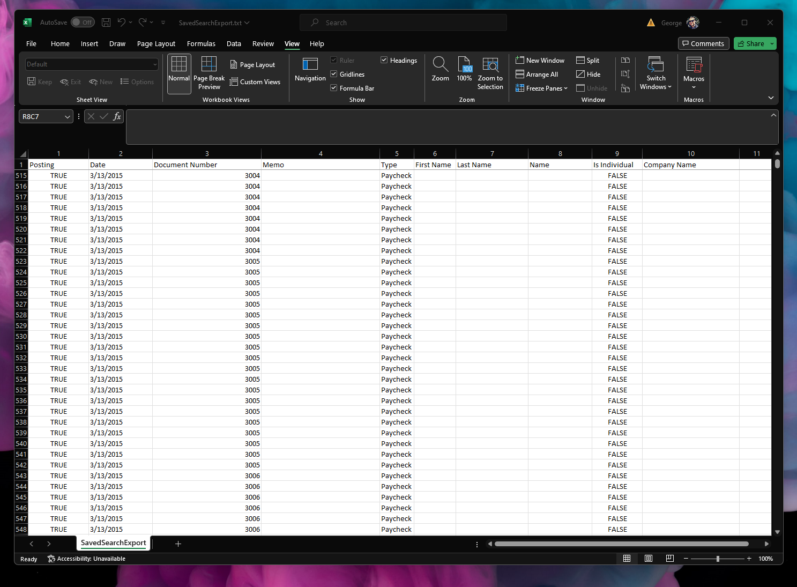

# NetSuite Saved Search Export CSV Papaparse
Simple Scheduled script that export Saved Search results to CSV file using Papaparse external library

## Used libraries
- papaparse v5.0.2 (for CSV file generation)

## Features
- Saved Search column labels are used for CSV headers
- File Cabinet file size limit is overcome by using appendLine

## Performance
- Tested with 10 column Saved Search / 112626 lines
- Processing time: 8 minutes
- Output CSV Filesize: 7.3 MB 

## Screenshots
